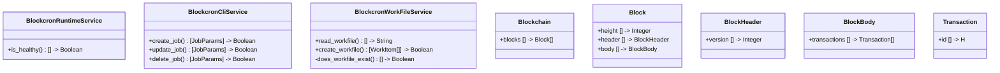

# adss
Advanced Decentralized Scheduling and Synchronization

```mermaid
classDiagram
  class BlockcronRuntimeService {
    +is_healthy() [] -> Boolean
  }

  class BlockcronCliService {
    +create_job() [JobParams] -> Boolean
    +update_job() [JobParams] -> Boolean
    +delete_job() [JobParams] -> Boolean
  }

  class BlockcronWorkFileService {
    +read_workfile() [] -> String
    +create_workfile() [WorkItem[]] -> Boolean
    -does_workfile_exist() [] -> Boolean
  }

  class Blockchain {
    +blocks [] -> Block[]
  }

  class Block {
    +height [] -> Integer
    +header [] -> BlockHeader
    +body [] -> BlockBody
  }

  class BlockHeader {
    +version [] -> Integer
  }

  class BlockBody {
    +transactions [] -> Transaction[]
  }

  class Transaction {
    +id [] -> H
  }
```
